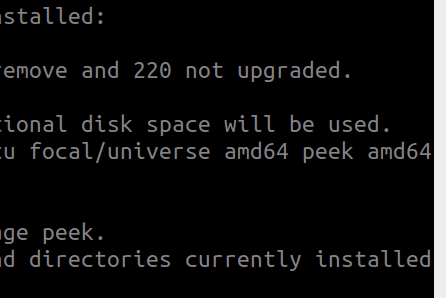

# Sokoban
[Sokoban](https://en.wikipedia.org/wiki/Sokoban) is Japanese for warehouse keeper and a traditional video game.
The game is a transportation puzzle, where the player has to push all boxes in the room on the storage locations/ targets.



## Getting Started

### Ubuntu
git clone the game:
```
$ cd ~
$ git clone git@github.com:ARG-NCTU/oop-proj-17.git
```
Run docker
```
$ cd oop-proj-17
$ source docker_run.sh
```
Start the game
```
$ python3 Sokoban.py
```
### Windows
Install Anaconda from following site.
https://docs.anaconda.com/free/anaconda/install/windows/
#### Download oop-proj-17
Download oop-proj-17 as a zip, and unzip.
#### activate base env, and start the game
You can change "oop_env" to what ever the name you like.
```
$ conda create --name oop_env python=3.8.10
$ conda activate oop_env
$ conda install -c conda-forge pygame
$ conda install -c conda-forge numpy
```
cd to your oop-proj-proj-17 dir location, and run the game.
```
$ cd oop-proj-proj-17
$ python Sokoban.py
```
## Game Environment
Every room consists of five main elements: walls, floor, boxes, box targets, and a player. They might have different states whether they overlap with a box target or not. 
